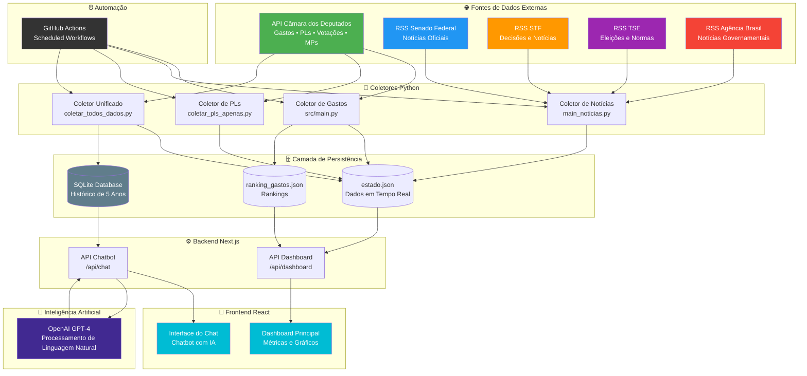
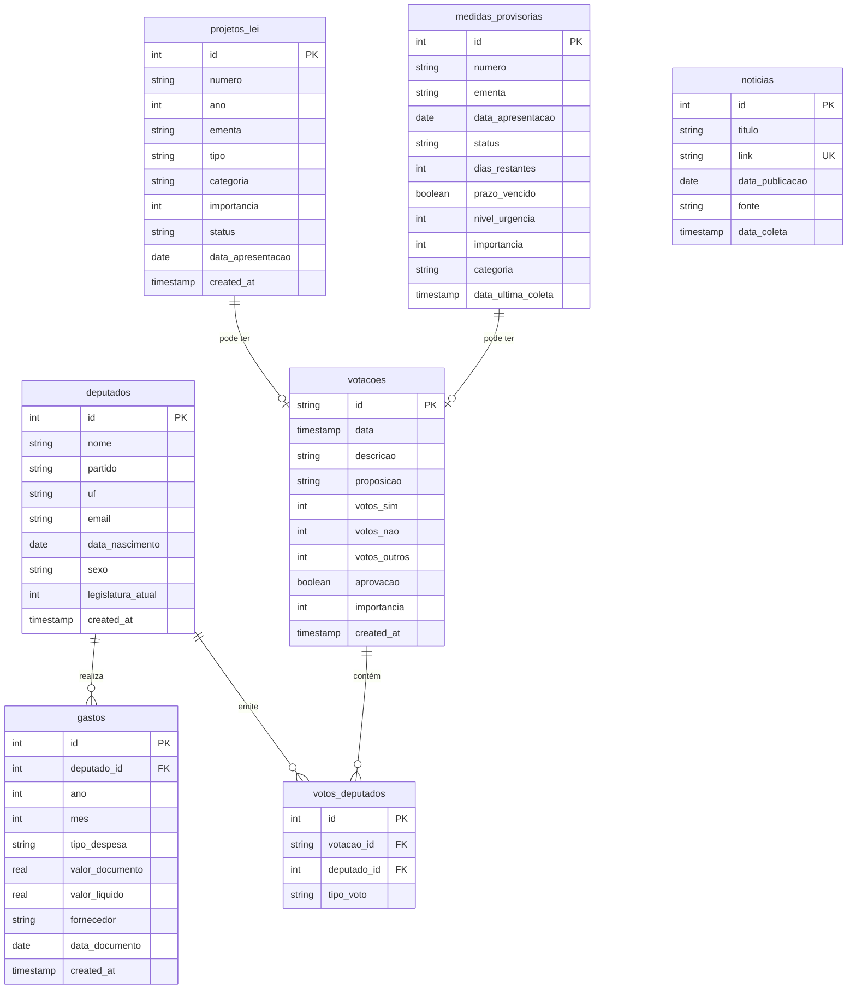
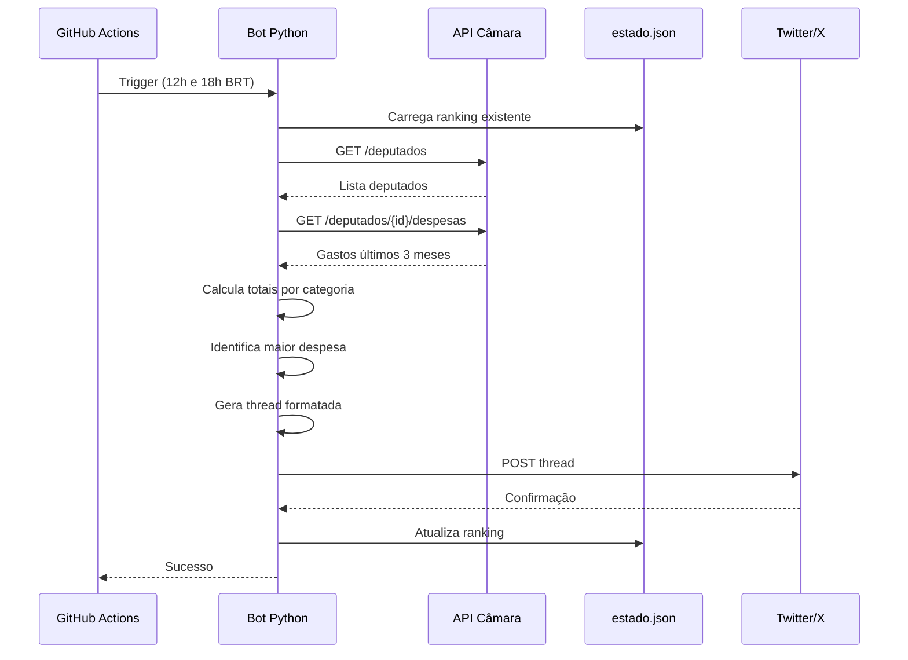
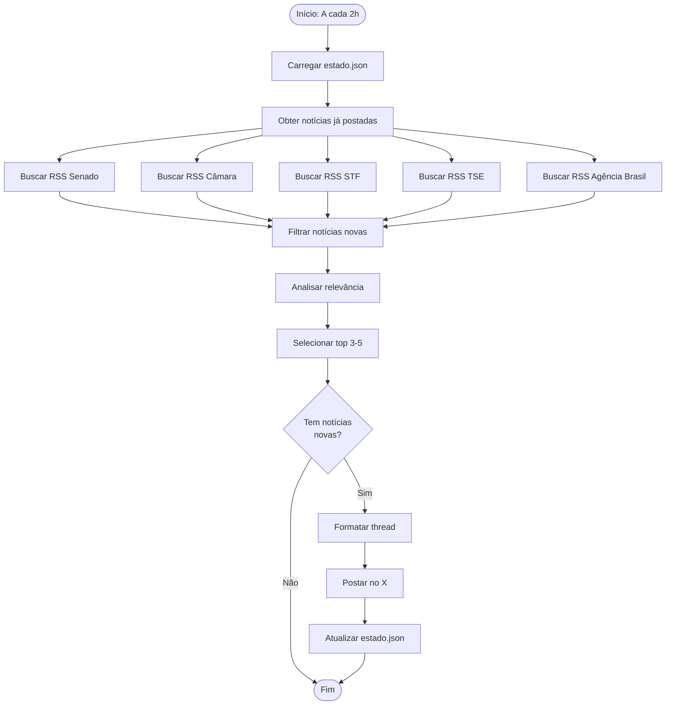
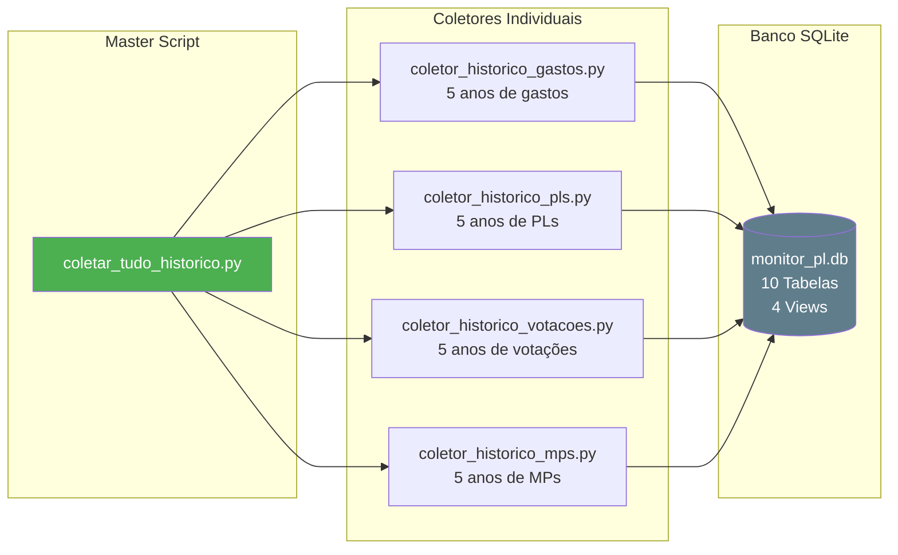
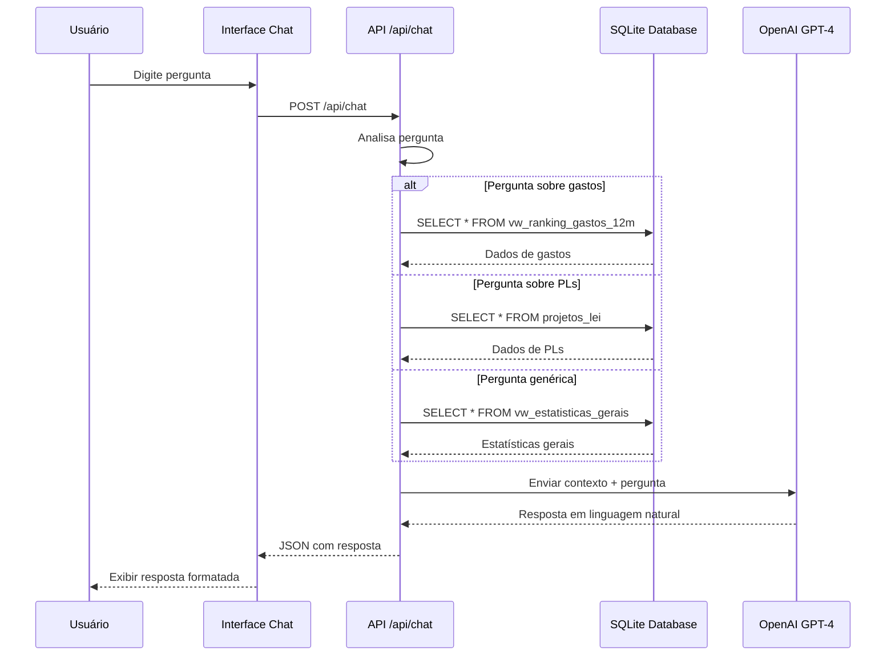
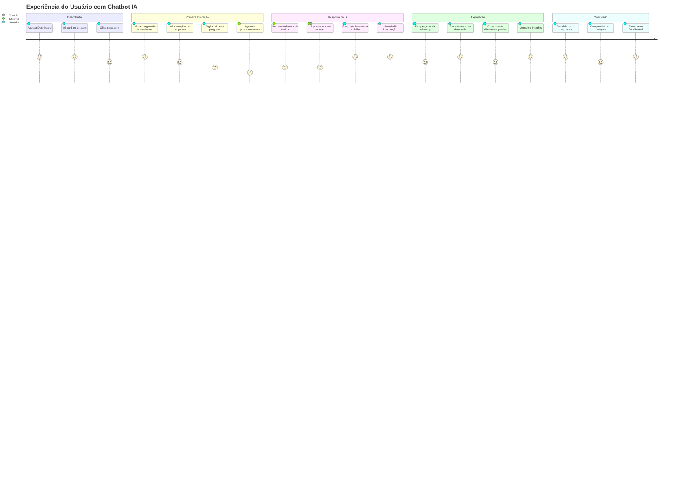
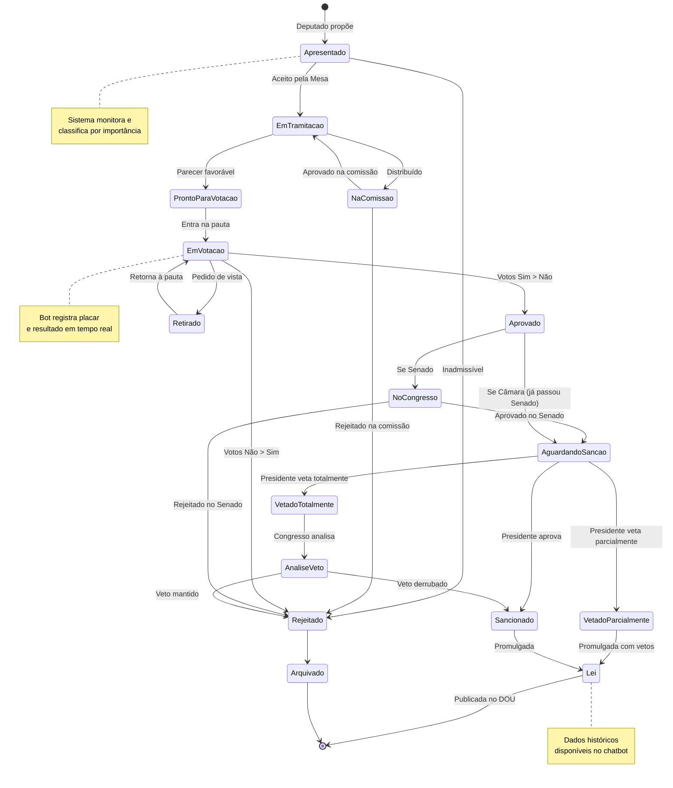

<div align="center">

# 🏛️ Monitor PL Brasil

### **Transparência Legislativa em Tempo Real com Inteligência Artificial**

[](https://python.org)
[](https://nextjs.org)
[](https://sqlite.org)
[](https://openai.com)
[](LICENSE)

**Sistema completo de monitoramento parlamentar brasileiro com IA conversacional**

[🌐 Dashboard](http://localhost:3001) • [🤖 Chatbot IA](#-chatbot-com-ia) • [🐦 Twitter/X](#-configuração-do-twitterx) • [🚀 Quick Start](#-quick-start) • [🤝 Contribuir](#-contribuindo)

---

</div>

## 📋 Índice

- [🎯 Sobre o Projeto](#-sobre-o-projeto)
- [⚡ Funcionalidades](#-funcionalidades)
- [🤖 Chatbot com IA](#-chatbot-com-ia)
- [🏗️ Arquitetura](#-arquitetura)
- [🚀 Quick Start](#-quick-start)
- [🐦 Configuração do Twitter/X](#-configuração-do-twitterx)
- [📊 Dashboard](#-dashboard)
- [🗄️ Banco de Dados](#-banco-de-dados)
- [📈 Fluxogramas](#-fluxogramas)
- [🔌 API REST](#-api-rest)
- [⚙️ GitHub Actions](#-github-actions)
- [💻 Tecnologias](#-tecnologias)
- [📁 Estrutura](#-estrutura-de-arquivos)
- [📚 Exemplos de Uso](#-exemplos-de-uso)
- [❓ FAQ & Troubleshooting](#-faq--troubleshooting)
- [🤝 Contribuindo](#-contribuindo)
- [🗺️ Roadmap](#-roadmap)

---

## 🎯 Sobre o Projeto

O **Monitor PL Brasil** é uma plataforma completa de fiscalização cívica que transforma dados públicos em informação acessível e acionável. Monitora em tempo real toda a atividade parlamentar brasileira e disponibiliza através de um dashboard moderno, API REST e um chatbot com inteligência artificial.

### 🌟 Diferenciais

<table>
<tr>
<td width="50%">

#### ✨ **Tecnologia de Ponta**
- 🤖 Chatbot com IA (OpenAI GPT-4)
- 📊 Dashboard em tempo real (Next.js 14)
- 🗄️ Banco de dados histórico (SQLite)
- 🔄 100% automatizado (GitHub Actions)

</td>
<td width="50%">

#### 📈 **Cobertura Completa**
- 💰 Gastos parlamentares
- 📋 Projetos de lei
- 🗳️ Votações plenárias
- ⚡ Medidas provisórias
- 📰 Notícias oficiais

</td>
</tr>
</table>

### 📊 Estatísticas do Projeto

```
📦 ~6.000+ Linhas de Código
👥 15+ Deputados Monitorados
💰 8.880+ Gastos Registrados
📋 100+ Projetos de Lei Rastreados
🗳️ 50+ Votações Analisadas
📰 500+ Notícias Agregadas
🤖 1 Chatbot Inteligente
```

---

## ⚡ Funcionalidades

<table>
<tr>
<td width="33%">

### 💰 **Gastos Parlamentares**

Monitora a Cota Parlamentar dos deputados federais.

**Dados Coletados:**
- ✅ Ranking dos maiores gastadores
- ✅ Gastos por categoria
- ✅ Histórico de 5 anos
- ✅ Comparação entre deputados
- ✅ Valores líquidos e brutos

**Período:** Últimos 3 meses

**Fonte:** [API Dados Abertos Câmara](https://dadosabertos.camara.leg.br/)

</td>
<td width="33%">

### 📰 **Agregador de Notícias**

Centraliza notícias dos Três Poderes.

**Fontes Oficiais:**
- 🏛️ Senado Federal
- 🏛️ Câmara dos Deputados
- ⚖️ STF (Supremo Tribunal Federal)
- 🗳️ TSE (Tribunal Superior Eleitoral)
- 📰 Agência Brasil (EBC)

**Atualização:** A cada 2 horas

**Formato:** RSS Feed Parser

</td>
<td width="33%">

### 📋 **Projetos de Lei**

Rastreia PLs por importância e tema.

**Análise Automática:**
- ⭐ Classificação de importância (1-5)
- 🏷️ Categorização por tema
- 📝 Ementas completas
- 🔄 Status de tramitação
- 📅 Data de apresentação

**Categorias:** Educação, Saúde, Economia, Meio Ambiente, etc.

</td>
</tr>
<tr>
<td width="50%">

### 🗳️ **Votações da Câmara**

Acompanha votações em plenário.

**Informações Exibidas:**
- ✅ Placar completo (Sim/Não/Outros)
- ✅ Resultado (Aprovado/Rejeitado)
- ✅ Importância da votação
- ✅ Data e horário
- ✅ Proposição relacionada
- ✅ Votos individuais dos deputados

**Fonte:** API Câmara em tempo real

</td>
<td width="50%">

### ⚡ **Medidas Provisórias**

Monitora MPs ativas e seus prazos.

**Rastreamento:**
- 🔴 Dias restantes (prazo: 120 dias)
- 🟡 Nível de urgência (1-5)
- 🟢 Status de tramitação
- 📊 Categoria e importância
- ⚠️ Alerta de prazo vencido

**Atualização:** 2x por dia

</td>
</tr>
</table>

---

## 🤖 Chatbot com IA

### **Assistente Inteligente de Dados Legislativos**

O Monitor PL Brasil inclui um chatbot powered by OpenAI que permite consultas em linguagem natural sobre todo o histórico de dados parlamentares.

<table>
<tr>
<td width="50%">

#### 🎯 **Capacidades**

- 💬 Conversa em linguagem natural
- 📊 Consulta dados de 5 anos
- 🔍 Busca inteligente no banco
- 📈 Gera estatísticas em tempo real
- 🎨 Interface amigável e moderna

</td>
<td width="50%">

#### 🗄️ **Dados Disponíveis**

- 👥 15+ deputados
- 💰 8.880+ gastos parlamentares
- 📋 Projetos de lei históricos
- 🗳️ Votações registradas
- ⚡ Medidas provisórias

</td>
</tr>
</table>

### 📝 Exemplos de Perguntas

```
💰 "Quem são os 10 deputados que mais gastaram?"
📊 "Quantos projetos de lei por categoria?"
🗳️ "Qual a taxa de aprovação das votações?"
📋 "Mostre os PLs mais importantes de 2024"
⚡ "Quais MPs estão com prazo vencendo?"
📈 "Estatísticas gerais do banco"
```

### 🎬 Como Usar o Chatbot

   ```bash
# 1. Inicialize o banco de dados
python3 database/init_db.py

# 2. (Opcional) Colete dados históricos
python3 database/coletar_tudo_historico.py --teste

# 3. Configure a OpenAI Key
echo 'OPENAI_API_KEY=sk-...' > dashboard/.env.local

# 4. Acesse o chatbot
http://localhost:3001/chat
```

### 🔌 API do Chatbot

   ```bash
# Endpoint
POST http://localhost:3001/api/chat

# Request
{
  "messages": [
    {"role": "user", "content": "Quem mais gastou?"}
  ]
}

# Response
{
  "message": "💰 Top 10 Deputados...",
  "timestamp": "2024-10-20T..."
}
```

---

## 🏗️ Arquitetura

### Arquitetura Geral do Sistema



---

## 🚀 Quick Start

### Pré-requisitos

   ```bash
✅ Python 3.10+
✅ Node.js 18+
✅ Git
✅ SQLite 3+ (incluído no Python)
```

### Instalação Completa

```bash
# 1️⃣ Clone o repositório
git clone https://github.com/gregorizeidler/Monitor-PL-Brasil.git
cd Monitor-PL-Brasil

# 2️⃣ Configure o ambiente Python
python3 -m venv venv
source venv/bin/activate  # Windows: venv\Scripts\activate
   pip install -r requirements.txt

# 3️⃣ Inicialize o banco de dados
python3 database/init_db.py

# 4️⃣ Configure o Dashboard
cd dashboard
npm install
cd ..

# 5️⃣ Configure variáveis de ambiente (opcional)
cp .env.example .env
# Edite .env com suas credenciais do X/Twitter e OpenAI
```

### Uso Rápido

```bash
# 🔄 Coletar dados (rápido - dados recentes)
python3 coletar_todos_dados.py

# 📊 Coletar histórico completo (5 anos - demora 2-4h)
python3 database/coletar_tudo_historico.py --anos 5

# 🚀 Iniciar dashboard
cd dashboard && npm run dev

# 🌐 Acessar aplicação
# Dashboard: http://localhost:3001
# Chatbot:   http://localhost:3001/chat
```

---

## 🐦 Configuração do Twitter/X

**⚠️ IMPORTANTE:** O Monitor PL Brasil foi criado para **postar automaticamente** threads no Twitter/X. Esta é a funcionalidade principal do projeto!

### 🎯 Por que configurar?

<table>
<tr>
<td width="50%">

#### ✅ **COM Credenciais**
- ✅ Coleta todos os dados
- ✅ Exibe no dashboard
- ✅ **Posta threads no X**
- ✅ Automação via GitHub Actions
- ✅ Engajamento público

</td>
<td width="50%">

#### ❌ **SEM Credenciais**
- ✅ Coleta todos os dados
- ✅ Exibe no dashboard
- ❌ **NÃO posta no X**
- ⚠️ Funcionalidade limitada

</td>
</tr>
</table>

### 📋 Passo a Passo

#### 1️⃣ Criar Conta de Desenvolvedor

1. Acesse [developer.twitter.com](https://developer.twitter.com/)
2. Faça login com sua conta do X
3. Clique em "Sign up for Free Account"
4. Preencha o formulário:
   - **Use Case:** "Transparência Pública / Fiscalização Cívica"
   - **Descrição:** "Bot para divulgar gastos parlamentares e atividade legislativa"
5. Aguarde aprovação (1-2 dias)

#### 2️⃣ Criar um App

1. No [Developer Portal](https://developer.twitter.com/en/portal/dashboard)
2. Clique em **"Create App"**
3. Nome: `Monitor PL Brasil Bot`
4. Anote as credenciais:
   ```
   API Key (Consumer Key)
   API Secret (Consumer Secret)
   ```

#### 3️⃣ Gerar Access Tokens

1. No seu app → **"Keys and Tokens"**
2. Em **"Access Token and Secret"** → **"Generate"**
3. Anote:
   ```
   Access Token
   Access Token Secret
   ```

#### 4️⃣ Configurar Localmente

     ```bash
# Copie o template
cp .env.example .env

# Edite com suas credenciais
nano .env
```

**Conteúdo do `.env`:**

```env
# Twitter/X API Credentials
X_API_KEY=sua_api_key_aqui
X_API_SECRET=sua_api_secret_aqui
X_ACCESS_TOKEN=seu_access_token_aqui
X_ACCESS_TOKEN_SECRET=seu_access_token_secret_aqui
```

#### 5️⃣ Configurar GitHub Actions

Para automação completa no GitHub:

1. Vá em **Settings** → **Secrets and variables** → **Actions**
2. Adicione os 4 secrets:
   - `X_API_KEY`
   - `X_API_SECRET`
   - `X_ACCESS_TOKEN`
   - `X_ACCESS_TOKEN_SECRET`

#### 6️⃣ Testar Localmente

     ```bash
# Teste o bot de gastos
python3 -m src.main

# Teste o bot de notícias
     python3 main_noticias.py

# Teste o bot de PLs
python3 main_projetos_lei.py
```

### 📱 O que será postado?

| Tipo | Frequência | Conteúdo |
|------|------------|----------|
| 💰 **Gastos** | 2x/dia (12h e 18h BRT) | Thread sobre gastos de 1 deputado |
| 📰 **Notícias** | A cada 2 horas | Thread com 3-5 notícias relevantes |
| 📋 **Projetos de Lei** | 1x/dia (10h BRT) | Thread sobre PLs importantes |

### ⚠️ Limites do X (Plano Free)

```
📊 Tweets: 50/dia
🔄 Retweets: 25/dia
❤️ Likes: 50/dia
➡️ DMs: 15/dia
```

**Dica:** O bot foi otimizado para respeitar esses limites!

### 🔒 Segurança

- ✅ **NUNCA** commite o arquivo `.env`
- ✅ Use GitHub Secrets para CI/CD
- ✅ Regenere tokens se vazarem
- ✅ Monitore o uso da API
- ✅ Revise permissões periodicamente

---

## 📊 Dashboard

### Interface Principal

O dashboard Next.js 14 exibe dados em tempo real com atualização automática a cada 30 segundos.

#### 🎨 Componentes

<table>
<tr>
<td width="50%">

**📈 Métricas Principais**
- 💰 Total de gastos (últimos 3 meses)
- 📋 Projetos de lei rastreados
- 📰 Notícias agregadas
- 🗳️ Votações recentes
- ⚡ MPs ativas

</td>
<td width="50%">

**📊 Visualizações**
- 🏆 Top 10 maiores gastadores
- 📋 Lista de PLs por categoria
- 📰 Feed de notícias
- 🗳️ Resultados de votações
- ⏰ Countdown de MPs

</td>
</tr>
</table>

#### 🚀 Tecnologias

- **Frontend:** React 18 + TypeScript
- **Framework:** Next.js 14 (App Router)
- **Styling:** Tailwind CSS 3.4
- **Icons:** Lucide React
- **Updates:** Polling a cada 30s

#### 💻 Desenvolvimento

```bash
# Modo desenvolvimento
cd dashboard
npm run dev

# Build para produção
npm run build
npm run start

# Linting
npm run lint
```

---

## 🗄️ Banco de Dados

### SQLite Database - Histórico Completo

O projeto inclui um banco de dados SQLite para armazenar **5 anos de dados históricos**, permitindo análises profundas e o funcionamento do chatbot com IA.

#### 🗺️ Diagrama ER (Entidade-Relacionamento)



#### 📊 Schema do Banco

```sql
-- 👥 Deputados
CREATE TABLE deputados (
    id INTEGER PRIMARY KEY,
    nome TEXT NOT NULL,
    partido TEXT,
    uf TEXT,
    email TEXT,
    data_nascimento DATE,
    sexo TEXT,
    legislatura_atual INTEGER,
    created_at TIMESTAMP DEFAULT CURRENT_TIMESTAMP
);

-- 💰 Gastos Parlamentares
CREATE TABLE gastos (
    id INTEGER PRIMARY KEY AUTOINCREMENT,
    deputado_id INTEGER NOT NULL,
    ano INTEGER NOT NULL,
    mes INTEGER NOT NULL,
    tipo_despesa TEXT NOT NULL,
    valor_documento REAL NOT NULL,
    valor_liquido REAL NOT NULL,
    fornecedor TEXT,
    data_documento DATE NOT NULL,
    FOREIGN KEY (deputado_id) REFERENCES deputados(id)
);

-- 📋 Projetos de Lei
CREATE TABLE projetos_lei (
    id INTEGER PRIMARY KEY,
    numero TEXT NOT NULL,
    ano INTEGER NOT NULL,
    ementa TEXT,
    tipo TEXT,
    categoria TEXT,
    importancia INTEGER,
    status TEXT,
    data_apresentacao DATE,
    created_at TIMESTAMP DEFAULT CURRENT_TIMESTAMP
);

-- 🗳️ Votações
CREATE TABLE votacoes (
    id TEXT PRIMARY KEY,
    data TIMESTAMP NOT NULL,
    descricao TEXT,
    proposicao TEXT,
    votos_sim INTEGER,
    votos_nao INTEGER,
    votos_outros INTEGER,
    aprovacao BOOLEAN,
    importancia INTEGER,
    created_at TIMESTAMP DEFAULT CURRENT_TIMESTAMP
);

-- ⚡ Medidas Provisórias
CREATE TABLE medidas_provisorias (
    id INTEGER PRIMARY KEY,
    numero TEXT NOT NULL,
    ementa TEXT,
    data_apresentacao TEXT,
    status TEXT,
    dias_restantes INTEGER,
    prazo_vencido BOOLEAN,
    nivel_urgencia INTEGER,
    importancia INTEGER,
    categoria TEXT,
    data_ultima_coleta TEXT
);

-- 📰 Notícias
CREATE TABLE noticias (
    id INTEGER PRIMARY KEY AUTOINCREMENT,
    titulo TEXT NOT NULL,
    link TEXT NOT NULL UNIQUE,
    data_publicacao TEXT NOT NULL,
    fonte TEXT NOT NULL,
    data_coleta TEXT DEFAULT CURRENT_TIMESTAMP
);
```

#### 📈 Views SQL

```sql
-- 📊 Estatísticas Gerais
CREATE VIEW vw_estatisticas_gerais AS
SELECT
    (SELECT COUNT(*) FROM deputados) AS total_deputados,
    (SELECT COUNT(*) FROM gastos) AS total_gastos,
    (SELECT SUM(valor_liquido) FROM gastos) AS valor_total_gastos,
    (SELECT COUNT(*) FROM projetos_lei) AS total_pls,
    (SELECT COUNT(*) FROM votacoes) AS total_votacoes,
    (SELECT COUNT(*) FROM medidas_provisorias) AS total_mps,
    (SELECT COUNT(*) FROM noticias) AS total_noticias;

-- 🏆 Ranking de Gastos (12 meses)
CREATE VIEW vw_ranking_gastos_12m AS
SELECT
    d.nome,
    d.partido,
    d.uf,
    SUM(g.valor_liquido) AS total_gasto_12m
FROM gastos g
JOIN deputados d ON g.deputado_id = d.id
WHERE g.data_documento >= date('now', '-12 months')
GROUP BY d.id
ORDER BY total_gasto_12m DESC;
```

#### 🔧 Comandos Úteis

```bash
# Inicializar banco
python3 database/init_db.py

# Coletar histórico completo (5 anos)
python3 database/coletar_tudo_historico.py --anos 5

# Coletar apenas teste (rápido)
python3 database/coletar_tudo_historico.py --teste

# Explorar banco diretamente
sqlite3 database/monitor_pl.db

# Consultas SQL
sqlite> SELECT * FROM vw_estatisticas_gerais;
sqlite> SELECT * FROM vw_ranking_gastos_12m LIMIT 10;
```

---

## 📈 Fluxogramas

### 1️⃣ Fluxo de Coleta de Gastos



### 2️⃣ Fluxo do Agregador de Notícias



### 3️⃣ Sistema de Coleta Histórica



### 4️⃣ Fluxo do Chatbot com IA



### 5️⃣ Pipeline GitHub Actions

```mermaid
gantt
    title Automação GitHub Actions (24h)
    dateFormat HH:mm
    axisFormat %H:%M

    section Gastos
    Bot Gastos (12h BRT)     :active, 09:00, 15m
    Bot Gastos (18h BRT)     :active, 15:00, 15m

    section Notícias
    Coleta 00h               :crit, 00:00, 10m
    Coleta 02h               :crit, 02:00, 10m
    Coleta 04h               :crit, 04:00, 10m
    Coleta 06h               :crit, 06:00, 10m
    Coleta 08h               :crit, 08:00, 10m
    Coleta 10h               :crit, 10:00, 10m
    Coleta 12h               :crit, 12:00, 10m
    Coleta 14h               :crit, 14:00, 10m
    Coleta 16h               :crit, 16:00, 10m
    Coleta 18h               :crit, 18:00, 10m
    Coleta 20h               :crit, 20:00, 10m
    Coleta 22h               :crit, 22:00, 10m

    section Dados Unificados
    Coleta 09h BRT           :done, 06:00, 20m
    Coleta 17h BRT           :done, 14:00, 20m

    section Ranking
    Geração Quinzenal        :milestone, 02:00, 0m
```



### 6️⃣ Jornada do Usuário no Chatbot



### 7️⃣ Ciclo de Vida de um Projeto de Lei



### 8️⃣ Arquitetura Frontend - Componentes React

```mermaid
graph TB
    subgraph "🎨 Next.js 14 App Router"
        Root[app/layout.tsx<br/>RootLayout<br/>Meta, Fonts, Globals]
    end
    
    subgraph "📊 Dashboard Principal"
        Dashboard[app/page.tsx<br/>Dashboard Component<br/>Estado + Fetch]
        
        subgraph "Cards de Métricas"
            GastosCard[GastosCard<br/>Total de Gastos<br/>Últimos 3 meses]
            NoticiasCard[NoticiasCard<br/>Feed de Notícias<br/>5 fontes]
            PLsCard[PLsCard<br/>Projetos Rastreados<br/>Por categoria]
            VotacoesCard[VotacoesCard<br/>Votações Recentes<br/>Placar completo]
            MPsCard[MPsCard<br/>Medidas Provisórias<br/>Dias restantes]
        end
        
        subgraph "Tabelas e Listas"
            RankingTable[RankingTable<br/>Top 10 Gastadores<br/>Ordenado por valor]
            NewsList[NewsList<br/>Lista de Notícias<br/>Com links]
            PLsList[PLsList<br/>Lista de PLs<br/>Com ementa]
            VotesList[VotesList<br/>Lista de Votações<br/>Resultado]
        end
        
        ChatLink[ChatLink Component<br/>Card clicável<br/>Link para /chat]
    end
    
    subgraph "🤖 Chatbot IA"
        ChatPage[app/chat/page.tsx<br/>ChatPage Component<br/>Estado de mensagens]
        
        subgraph "Componentes do Chat"
            ChatHeader[ChatHeader<br/>Navegação + Título]
            MessagesList[MessagesList<br/>Array de mensagens<br/>User + Assistant]
            MessageBubble[MessageBubble<br/>Bubble individual<br/>Formatação]
            ChatInput[ChatInput<br/>Input + Button<br/>onSubmit handler]
            LoadingIndicator[LoadingIndicator<br/>Dots animados<br/>Enquanto IA processa]
        end
    end
    
    subgraph "🔌 API Routes"
        DashboardAPI[api/dashboard/route.ts<br/>GET /api/dashboard<br/>Lê estado.json]
        ChatAPI[api/chat/route.ts<br/>POST /api/chat<br/>SQLite + OpenAI]
    end
    
    subgraph "📦 Data Sources"
        EstadoJSON[(estado.json<br/>Dados em tempo real)]
        RankingJSON[(ranking_gastos.json<br/>Top gastadores)]
        SQLite[(monitor_pl.db<br/>Histórico 5 anos)]
    end
    
    subgraph "🎨 Styling & Icons"
        Tailwind[Tailwind CSS<br/>Utility Classes<br/>Gradient Backgrounds]
        Lucide[Lucide Icons<br/>RefreshCw, TrendingDown<br/>Newspaper, etc]
    end
    
    Root --> Dashboard
    Root --> ChatPage
    
    Dashboard --> GastosCard
    Dashboard --> NoticiasCard
    Dashboard --> PLsCard
    Dashboard --> VotacoesCard
    Dashboard --> MPsCard
    Dashboard --> RankingTable
    Dashboard --> NewsList
    Dashboard --> PLsList
    Dashboard --> VotesList
    Dashboard --> ChatLink
    
    ChatPage --> ChatHeader
    ChatPage --> MessagesList
    ChatPage --> ChatInput
    MessagesList --> MessageBubble
    ChatPage --> LoadingIndicator
    
    Dashboard -->|fetch every 30s| DashboardAPI
    ChatPage -->|POST messages| ChatAPI
    
    DashboardAPI --> EstadoJSON
    DashboardAPI --> RankingJSON
    ChatAPI --> SQLite
    
    Dashboard --> Tailwind
    Dashboard --> Lucide
    ChatPage --> Tailwind
    ChatPage --> Lucide
    
    ChatLink -.->|Link| ChatPage
    
    style Root fill:#1e293b,color:#fff
    style Dashboard fill:#0ea5e9,color:#fff
    style ChatPage fill:#8b5cf6,color:#fff
    style DashboardAPI fill:#10b981,color:#fff
    style ChatAPI fill:#f59e0b,color:#fff
    style SQLite fill:#6366f1,color:#fff
    style Tailwind fill:#06b6d4,color:#fff
    style Lucide fill:#f97316,color:#fff
```



---

## 🔌 API REST

### Endpoints Disponíveis

#### 📊 Dashboard Data

```bash
GET http://localhost:3001/api/dashboard
```

**Response:**

```json
{
  "gastos": {
    "totalGastadores": 15,
    "valorTotal": 3973309.53,
    "topGastadores": [
      {
        "nome": "Adail Filho",
        "partido": "REPUBLICANOS",
        "uf": "AM",
        "total": 1037009.44
      }
    ]
  },
  "noticias": {
    "total": 500,
    "recentes": [
      {
        "titulo": "Senado aprova PL...",
        "fonte": "Senado Federal",
        "link": "https://...",
        "data": "2024-10-20T..."
      }
    ]
  },
  "projetos": {
    "totalRastreados": 100,
    "recentes": [
      {
        "numero": "PL 1234/2024",
        "ementa": "Dispõe sobre...",
        "categoria": "educação",
        "importancia": 4
      }
    ]
  },
  "votacoes": {
    "totalVotacoes": 50,
    "recentes": [
      {
        "descricao": "Votação da PEC...",
        "aprovacao": true,
        "votos_sim": 350,
        "votos_nao": 120,
        "data": "2024-10-15T..."
      }
    ]
  },
  "medidas_provisorias": {
    "totalAtivas": 10,
    "recentes": [
      {
        "numero": "MPV 1234/2024",
        "dias_restantes": 45,
        "nivel_urgencia": 3,
        "categoria": "economia"
      }
    ]
  },
  "ultimaAtualizacao": "2024-10-20T..."
}
```

#### 🤖 Chatbot

```bash
POST http://localhost:3001/api/chat
Content-Type: application/json
```

**Request:**

```json
{
  "messages": [
    {
      "role": "user",
      "content": "Quem são os 5 deputados que mais gastaram?"
    }
  ]
}
```

**Response:**

```json
{
  "message": "💰 **Top 5 Deputados que Mais Gastaram:**\n\n1. **Adail Filho** (REPUBLICANOS-AM)\n   💵 R$ 1,037,009.44\n\n2. **Afonso Motta** (PDT-RS)\n   💵 R$ 976,665.97\n...",
  "timestamp": "2024-10-20T..."
}
```

---

## ⚙️ GitHub Actions

### Workflows Automatizados

#### 💰 Bot de Gastos

```yaml
# .github/workflows/bot-schedule.yml
name: Monitor PL - Bot de Gastos

on:
  schedule:
    # 15:00 UTC = 12:00 BRT | 21:00 UTC = 18:00 BRT
    - cron: '0 15,21 * * *'
  workflow_dispatch: # Permite execução manual

jobs:
  run_bot:
    runs-on: ubuntu-latest
    steps:
      - uses: actions/checkout@v4
      - uses: actions/setup-python@v5
        with:
          python-version: '3.10'
      - run: pip install -r requirements.txt
      - run: python3 -m src.main
        env:
          X_API_KEY: ${{ secrets.X_API_KEY }}
          X_API_SECRET: ${{ secrets.X_API_SECRET }}
          X_ACCESS_TOKEN: ${{ secrets.X_ACCESS_TOKEN }}
          X_ACCESS_TOKEN_SECRET: ${{ secrets.X_ACCESS_TOKEN_SECRET }}
```

#### 📰 Bot de Notícias

```yaml
# .github/workflows/noticias-bot.yml
name: Monitor PL - Bot de Notícias

on:
  schedule:
    # A cada 2 horas
    - cron: '0 */2 * * *'
  workflow_dispatch:
```

#### 📋 Coletor de Dados Unificado

```yaml
# .github/workflows/coletar-todos-dados.yml
name: Monitor PL - Coletar Todos os Dados

on:
  schedule:
    # 12:00 UTC (09:00 BRT) e 20:00 UTC (17:00 BRT)
    - cron: '0 12,20 * * *'
  workflow_dispatch:

jobs:
  collect_data:
    runs-on: ubuntu-latest
    steps:
      - uses: actions/checkout@v4
      - uses: actions/setup-python@v5
      - run: pip install -r requirements.txt
      - run: python3 coletar_todos_dados.py
      - name: Commit dados atualizados
        run: |
          git config user.name "GitHub Actions Bot"
          git config user.email "actions@github.com"
          git add estado.json
          git commit -m "🤖 Atualiza dados" || echo "Nenhuma alteração"
          git push
```

#### 🏆 Gerador de Ranking

```yaml
# .github/workflows/generate-ranking.yml
name: Monitor PL - Gerador de Ranking

on:
  schedule:
    # Dias 1 e 15 de cada mês, às 05:00 UTC (02:00 BRT)
    - cron: '0 5 1,15 * *'
  workflow_dispatch:
```

---

## 💻 Tecnologias

### Backend

| Tecnologia | Versão | Uso |
|------------|--------|-----|
|  | 3.10+ | Coletores e processamento |
|  | 3+ | Banco de dados |
|  | 2.31+ | HTTP Client |
|  | 4.14+ | Twitter API |
|  | 6.0+ | RSS Parser |

### Frontend

| Tecnologia | Versão | Uso |
|------------|--------|-----|
|  | 14 | Framework React |
|  | 18 | UI Library |
|  | 5 | Type Safety |
|  | 3.4 | Styling |
|  | Latest | Icons |

### Inteligência Artificial

| Tecnologia | Versão | Uso |
|------------|--------|-----|
|  | GPT-4 | Chatbot IA |

### DevOps

| Tecnologia | Uso |
|------------|-----|
|  | CI/CD e Automação |
|  | Controle de Versão |

---

## 📁 Estrutura de Arquivos

```
Monitor-PL-Brasil/
├── 📂 .github/
│   └── workflows/
│       ├── bot-schedule.yml              # Bot de gastos (2x/dia)
│       ├── generate-ranking.yml          # Ranking quinzenal
│       ├── noticias-bot.yml              # Bot de notícias (2h)
│       └── coletar-todos-dados.yml       # Coleta unificada (2x/dia)
│
├── 📂 src/
│   ├── __init__.py
│   ├── main.py                           # Bot de gastos parlamentares
│   ├── api_client.py                     # Cliente API Câmara
│   ├── gerador_de_ranking.py             # Gerador de ranking
│   │
│   ├── 📂 coletores/
│   │   ├── coleta_camara.py              # Gastos da Câmara
│   │   ├── coleta_senado.py              # Notícias Senado
│   │   ├── coleta_stf.py                 # Notícias STF
│   │   ├── coleta_tse.py                 # Notícias TSE
│   │   ├── coleta_agenciabrasil.py       # Notícias Agência Brasil
│   │   ├── coleta_projetos_lei.py        # Projetos de Lei
│   │   ├── coleta_votacoes.py            # Votações
│   │   └── coleta_medidas_provisorias.py # MPs
│   │
│   ├── 📂 analisador/
│   │   └── analisador_noticias.py        # Análise de relevância
│   │
│   └── 📂 formatadores/
│       └── formatador_noticias.py        # Formatação de threads
│
├── 📂 database/
│   ├── schema.sql                        # Schema SQLite
│   ├── init_db.py                        # Inicializador do banco
│   ├── coletor_historico_gastos.py       # Coleta 5 anos de gastos
│   ├── coletor_historico_pls.py          # Coleta 5 anos de PLs
│   ├── coletor_historico_votacoes.py     # Coleta 5 anos de votações
│   ├── coletor_historico_mps.py          # Coleta 5 anos de MPs
│   ├── coletar_tudo_historico.py         # Script master
│   └── monitor_pl.db                     # Banco SQLite (gerado)
│
├── 📂 dashboard/
│   ├── package.json
│   ├── next.config.js
│   ├── tailwind.config.ts
│   ├── tsconfig.json
│   ├── .env.local                        # Variáveis de ambiente (criar)
│   │
│   ├── 📂 app/
│   │   ├── layout.tsx                    # Layout principal
│   │   ├── page.tsx                      # Dashboard principal
│   │   ├── globals.css                   # Estilos globais
│   │   │
│   │   ├── 📂 api/
│   │   │   ├── dashboard/
│   │   │   │   └── route.ts              # API dados dashboard
│   │   │   └── chat/
│   │   │       └── route.ts              # API chatbot
│   │   │
│   │   └── 📂 chat/
│   │       └── page.tsx                  # Interface chatbot
│   │
│   └── 📂 node_modules/                  # Dependências (npm install)
│
├── 📂 scripts/
│   └── setup_n8n_workflow.sh             # Script de setup n8n
│
├── 📄 main_noticias.py                   # Bot de notícias
├── 📄 main_projetos_lei.py               # Bot de PLs (com post X)
├── 📄 coletar_pls_apenas.py              # Coletar PLs (sem post)
├── 📄 coletar_todos_dados.py             # Coletor unificado
│
├── 📄 estado.json                        # Estado em tempo real (gerado)
├── 📄 ranking_gastos.json                # Ranking atual (gerado)
│
├── 📄 requirements.txt                   # Dependências Python
├── 📄 .env                               # Credenciais (criar)
├── 📄 .env.example                       # Template de .env
├── 📄 .gitignore                         # Arquivos ignorados
├── 📄 README.md                          # Este arquivo
└── 📄 LICENSE                            # Licença MIT
```

---

## 📚 Exemplos de Uso

### 1️⃣ Executar Bot de Gastos Localmente

```bash
# Ativar ambiente virtual
source venv/bin/activate

# Rodar bot (irá postar no X se configurado)
python3 -m src.main

# Output esperado:
# 📊 Gastos Parlamentares: R$ 123,456.78
# Deputado(a): João Silva (PT) utilizou este valor...
# 👇 Siga o fio para ver os detalhes...
# ✅ Thread postada com sucesso!
```

### 2️⃣ Gerar Ranking de Gastos

```bash
python3 -m src.gerador_de_ranking

# Gera: ranking_gastos.json
# {
#   "ranking": [
#     {
#       "id": 123,
#       "nome": "Adail Filho",
#       "partido": "REPUBLICANOS",
#       "uf": "AM",
#       "total_gasto": 1037009.44
#     },
#     ...
#   ]
# }
```

### 3️⃣ Coletar Notícias

```bash
python3 main_noticias.py

# Output:
# 📰 Coletando notícias de 5 fontes...
# ✅ Senado: 10 notícias
# ✅ Câmara: 8 notícias
# ✅ STF: 5 notícias
# ✅ TSE: 3 notícias
# ✅ Agência Brasil: 12 notícias
# 
# 🔍 Analisando relevância...
# ✅ 5 notícias selecionadas para thread
# ✅ Thread postada com sucesso!
```

### 4️⃣ Rastrear Projetos de Lei

```bash
# Coletar PLs sem postar (para dashboard)
python3 coletar_pls_apenas.py

# Output:
# 📋 Encontrados 30 projetos de lei
# ⭐⭐⭐⭐⭐ PL 1234/2024 - Saúde
# ⭐⭐⭐⭐   PL 5678/2024 - Educação
# ⭐⭐⭐     PL 9012/2024 - Economia
# 
# ✅ 10 novos PLs rastreados
# 📊 Resumo por categoria:
#    {
#      "saúde": 3,
#      "educação": 4,
#      "economia": 2,
#      "meio ambiente": 1
#    }
```

### 5️⃣ Coletar Histórico Completo (5 Anos)

```bash
# Modo completo (demora 2-4 horas)
python3 database/coletar_tudo_historico.py --anos 5

# Modo teste (rápido, poucos dados)
python3 database/coletar_tudo_historico.py --teste

# Output:
# ╔═══════════════════════════════════════════════╗
# ║  🚀 COLETA HISTÓRICA COMPLETA - 5 ANOS       ║
# ╚═══════════════════════════════════════════════╝
# 
# [████████████████████████████████████████] 25%
# Etapa 1/4: Coletando gastos parlamentares
# 
# ✅ Deputados: 513
# ✅ Gastos: 245,678 registros
# ✅ PLs: 12,345 projetos
# ✅ Votações: 3,456 votações
# ✅ MPs: 234 medidas provisórias
# 
# 💾 Tamanho do banco: 156.78 MB
# ⏱️  Tempo total: 2h 15m 43s
```

### 6️⃣ Consultar Banco de Dados

```bash
# Abrir banco SQLite
sqlite3 database/monitor_pl.db

# Consultas úteis:

# 1. Estatísticas gerais
sqlite> SELECT * FROM vw_estatisticas_gerais;

# 2. Top 10 gastadores (12 meses)
sqlite> SELECT * FROM vw_ranking_gastos_12m LIMIT 10;

# 3. PLs por categoria
sqlite> SELECT categoria, COUNT(*) as total 
        FROM projetos_lei 
        GROUP BY categoria 
        ORDER BY total DESC;

# 4. Taxa de aprovação de votações
sqlite> SELECT * FROM vw_taxa_aprovacao_votacoes;

# 5. MPs com prazo vencendo (< 30 dias)
sqlite> SELECT numero, ementa, dias_restantes
        FROM medidas_provisorias
        WHERE dias_restantes < 30 AND prazo_vencido = 0
        ORDER BY dias_restantes ASC;
```

### 7️⃣ Usar o Chatbot

```bash
# 1. Iniciar dashboard
cd dashboard && npm run dev

# 2. Acessar chatbot
# http://localhost:3001/chat

# 3. Exemplos de perguntas:

💬 "Quem são os 10 deputados que mais gastaram?"
💬 "Quantos projetos de lei por categoria?"
💬 "Qual a taxa de aprovação das votações?"
💬 "Mostre os PLs mais importantes de 2024"
💬 "Quais MPs estão com prazo vencendo?"
💬 "Estatísticas gerais do banco"
💬 "Quanto gastou o deputado João Silva?"
💬 "PLs de educação aprovados"
```

### 8️⃣ Usar API REST

```bash
# 1. Dashboard data
curl -X GET http://localhost:3001/api/dashboard | jq

# 2. Chatbot query
curl -X POST http://localhost:3001/api/chat \
  -H "Content-Type: application/json" \
  -d '{
    "messages": [
      {"role": "user", "content": "Quem mais gastou?"}
    ]
  }' | jq

# 3. Python example
import requests

response = requests.get('http://localhost:3001/api/dashboard')
data = response.json()

print(f"Total de gastos: R$ {data['gastos']['valorTotal']:,.2f}")
print(f"PLs rastreados: {data['projetos']['totalRastreados']}")
```

---

## ❓ FAQ & Troubleshooting

### Problemas Comuns

#### 🔴 Dashboard não inicia

```bash
# Erro: Cannot find module '@tailwindcss/postcss'
cd dashboard
npm install @tailwindcss/postcss --save-dev

# Erro: next.config.ts not supported
mv dashboard/next.config.ts dashboard/next.config.js
```

#### 🔴 Erro ao coletar dados da API

```bash
# Erro: 429 Too Many Requests
# Solução: A API tem rate limit. Aguarde alguns minutos.

# Erro: 500 Internal Server Error
# Solução: A API pode estar temporariamente indisponível.
# Tente novamente mais tarde.
```

#### 🔴 Bot não posta no X

```bash
# Verifique se as credenciais estão corretas
cat .env

# Teste as credenciais
python3 -c "
import os
from dotenv import load_dotenv
load_dotenv()
print('API Key:', os.getenv('X_API_KEY')[:10] + '...')
print('Access Token:', os.getenv('X_ACCESS_TOKEN')[:10] + '...')
"

# Teste o bot
python3 -m src.main
```

#### 🔴 Banco de dados não tem dados

```bash
# Inicializar banco
python3 database/init_db.py

# Coletar dados de teste
python3 database/coletar_tudo_historico.py --teste

# Verificar dados
sqlite3 database/monitor_pl.db "SELECT COUNT(*) FROM gastos;"
```

#### 🔴 Chatbot retorna erro

```bash
# Verifique se a OpenAI Key está configurada
cat dashboard/.env.local

# O chatbot também funciona SEM OpenAI!
# Ele usa lógica própria baseada em padrões SQL
```

### Perguntas Frequentes

#### ❓ Qual a diferença entre `coletar_pls_apenas.py` e `main_projetos_lei.py`?

- **`coletar_pls_apenas.py`**: Apenas coleta e salva no `estado.json`. NÃO posta no X.
- **`main_projetos_lei.py`**: Coleta, salva E posta threads no X.

Use o primeiro para popular o dashboard sem postar no X.

#### ❓ Os dados são atualizados automaticamente?

**Sim!** Via GitHub Actions:
- Gastos: 2x/dia (12h e 18h BRT)
- Notícias: A cada 2 horas
- PLs/Votações/MPs: 2x/dia (9h e 17h BRT)
- Ranking: Quinzenalmente

#### ❓ Posso usar sem Twitter/X?

**Sim!** O dashboard e o chatbot funcionam perfeitamente sem credenciais do X. Você só não conseguirá postar threads públicas.

#### ❓ Quanto tempo demora a coleta histórica?

- **Modo Teste** (`--teste`): ~5 minutos
- **1 Ano**: ~30-45 minutos
- **5 Anos Completos**: 2-4 horas

Depende da velocidade da internet e do rate limit da API.

#### ❓ O banco de dados fica muito grande?

Para 5 anos de dados:
- Gastos: ~150 MB
- PLs: ~20 MB
- Votações: ~30 MB
- **Total**: ~200-250 MB

Muito leve e rápido!

#### ❓ Posso contribuir com o projeto?

**SIM!** Veja a seção [Contribuindo](#-contribuindo) abaixo.

---

## 🤝 Contribuindo

Contribuições são bem-vindas! Este projeto é open-source e feito para a comunidade.

### 🎯 Como Contribuir

1. **Fork o projeto**
2. **Crie uma branch** para sua feature: `git checkout -b feature/MinhaFeature`
3. **Commit suas mudanças**: `git commit -m 'feat: Adiciona MinhaFeature'`
4. **Push para a branch**: `git push origin feature/MinhaFeature`
5. **Abra um Pull Request**

### 📋 Áreas para Contribuição

- 🐛 **Correção de bugs**
- ✨ **Novas features**
- 📚 **Documentação**
- 🎨 **Melhorias no design**
- 🧪 **Testes automatizados**
- 🌐 **Tradução**
- ♿ **Acessibilidade**

### 💡 Ideias de Features

- [ ] Gráficos interativos no dashboard
- [ ] Exportação de dados (CSV, Excel)
- [ ] Alertas personalizados por email
- [ ] Comparação entre legislaturas
- [ ] API pública documentada (Swagger)
- [ ] App mobile (React Native)
- [ ] Análise de sentimento em notícias
- [ ] Integração com Telegram Bot
- [ ] Sistema de notificações (Push)
- [ ] Dark mode no dashboard

### 🏆 Contribuidores

Obrigado a todos que contribuem para este projeto!

<a href="https://github.com/gregorizeidler/Monitor-PL-Brasil/graphs/contributors">
  
</a>

---

## 🗺️ Roadmap

### ✅ Fase 1 - MVP (Concluído)

- [x] Bot de gastos parlamentares
- [x] Bot de notícias
- [x] Dashboard Next.js
- [x] API REST
- [x] GitHub Actions

### ✅ Fase 2 - Expansão (Concluído)

- [x] Rastreamento de PLs
- [x] Monitoramento de votações
- [x] Acompanhamento de MPs
- [x] Sistema de categorização

### ✅ Fase 3 - Inteligência (Concluído)

- [x] Banco de dados SQLite
- [x] Coleta histórica (5 anos)
- [x] Chatbot com OpenAI
- [x] Análise de dados avançada

### 🚧 Fase 4 - Aperfeiçoamento (Em Progresso)

- [ ] Testes automatizados (Jest + Pytest)
- [ ] CI/CD completo
- [ ] Documentação API (Swagger)
- [ ] Otimização de performance
- [ ] Monitoramento e logs

### 🔮 Fase 5 - Futuro

- [ ] App mobile
- [ ] Sistema de alertas
- [ ] Análise preditiva com ML
- [ ] Integração Telegram
- [ ] API pública

---

## 📜 Licença

Este projeto está sob a licença **MIT**. Veja o arquivo [LICENSE](LICENSE) para mais detalhes.

```
MIT License

Copyright (c) 2025 Monitor PL Brasil

É concedida permissão, gratuitamente, a qualquer pessoa que obtenha uma
cópia deste software e dos arquivos de documentação associados, para
usar o Software sem restrições, incluindo, sem limitação, os direitos
de usar, copiar, modificar, mesclar, publicar, distribuir, sublicenciar
e/ou vender cópias do Software.
```

---

## 🙏 Agradecimentos

- **[Câmara dos Deputados](https://dadosabertos.camara.leg.br/)** - API de Dados Abertos
- **[Senado Federal](https://www12.senado.leg.br/)** - RSS Feed de Notícias
- **[OpenAI](https://openai.com/)** - GPT-4 para o chatbot
- **[Vercel](https://vercel.com/)** - Framework Next.js
- **[GitHub](https://github.com/)** - Hospedagem e Actions

---

## 📞 Contato

**Projeto:** Monitor PL Brasil
**Repositório:** [github.com/gregorizeidler/Monitor-PL-Brasil](https://github.com/gregorizeidler/Monitor-PL-Brasil)

---

<div align="center">

**Monitor PL Brasil** © 2025 • Projeto de Transparência Legislativa

**Desenvolvido com:**


**[⭐ Star no GitHub](https://github.com/gregorizeidler/Monitor-PL-Brasil)** • **[🐛 Reportar Bug](https://github.com/gregorizeidler/Monitor-PL-Brasil/issues)** • **[💡 Sugerir Feature](https://github.com/gregorizeidler/Monitor-PL-Brasil/issues)**

</div>
